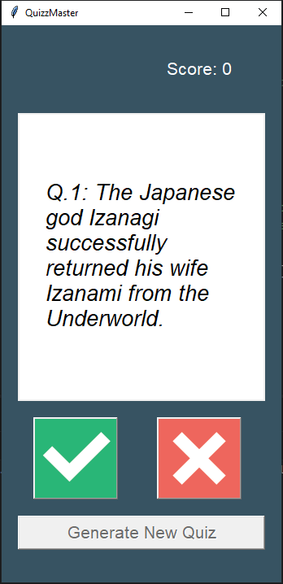

# Quiz App

A desktop **True/False Quiz Application** built with Python and Tkinter.

This project was developed as part of **Angela Yu's 100 Days of Code: The Complete Python Pro Bootcamp** and further organized and customized while learning Python, object-oriented programming, and GUI development.

The application presents a series of questions, tracks the user's progress and score, and provides immediate visual feedback after each answer.

---

## Preview




---

## Features

* True/False quiz questions
* Interactive graphical user interface
* Score tracking
* Question progress indicator
* Immediate visual feedback
* Separate modules for application components
* Object-oriented quiz logic
* Restart the quiz after completion
* Custom True/False button graphics

---

## Built With


---

## Project Structure

```text
Quiz-App/
│
├── images/
│   ├── true.png
│   ├── false.png
│   └── QuizzMaster_snapshot.png
│
├── main.py
├── data.py
├── question_model.py
├── quiz_brain.py
├── ui.py
├── requirements.txt
└── README.md
```

### `main.py`

The main entry point of the application.

It initializes the quiz and connects the quiz logic with the graphical user interface.

### `data.py`

Contains the question data used by the quiz.

### `question_model.py`

Defines the `Question` class.

Each question object contains the question text and its corresponding correct answer.

### `quiz_brain.py`

Contains the `QuizBrain` class and manages the core quiz logic.

Responsibilities include:

* Keeping track of the current question
* Retrieving questions
* Checking answers
* Updating the score
* Determining when the quiz is finished

### `ui.py`

Contains the graphical user interface built with Tkinter.

Responsibilities include:

* Displaying questions
* Displaying the current score
* Showing question progress
* Handling True/False button clicks
* Providing visual feedback
* Displaying the final result
* Starting a new quiz

### `images/`

Contains the graphical assets used by the application.

---

## Getting Started

### Prerequisites

Make sure you have **Python 3** installed on your computer.

You can check your Python installation with:

```bash
python --version
```

The application uses **Tkinter**, which is included with most standard Python installations.

---

## Installation

### 1. Clone the repository

```bash
git clone https://github.com/YOUR-USERNAME/Quiz-App.git
```

### 2. Navigate to the project directory

```bash
cd Quiz-App
```

### 3. Run the application

```bash
python main.py
```

The quiz window should open automatically.

---

## How to Play

1. Start the application.
2. Read the question displayed on the screen.
3. Select **True** or **False**.
4. The application immediately indicates whether the answer was correct.
5. Continue through the questions while keeping track of your score.
6. At the end of the quiz, your final score is displayed.
7. Start a new quiz if you want to play again.

---

## Concepts Practiced

This project was an opportunity to practice several Python concepts:

* **Object-Oriented Programming**

  * Classes
  * Objects
  * Methods
  * Attributes

* **Modular programming**

  * Splitting the application into multiple Python files
  * Importing and using classes from other modules

* **Tkinter GUI development**

  * Windows
  * Labels
  * Buttons
  * Canvas
  * Event handling

* **Program state**

  * Tracking the current question
  * Tracking the score
  * Managing quiz progress

* **Python data structures**

  * Lists
  * Dictionaries

* **Functions and conditional logic**

---

## Project Architecture

The application separates the **data**, **quiz logic**, and **user interface** into different modules.

```text
             ┌─────────────┐
             │   main.py   │
             └──────┬──────┘
                    │
          ┌─────────┴─────────┐
          │                   │
          ▼                   ▼
   ┌─────────────┐     ┌─────────────┐
   │ quiz_brain  │     │     ui      │
   │    .py      │     │    .py      │
   └──────┬──────┘     └──────┬──────┘
          │                   │
          ▼                   │
   ┌─────────────┐            │
   │question_model│            │
   │    .py      │            │
   └──────┬──────┘            │
          │                   │
          └─────────┬─────────┘
                    ▼
              ┌───────────┐
              │  data.py  │
              └───────────┘
```

This separation makes the application easier to understand, maintain, and extend.

---

## Future Improvements

Possible improvements for future versions include:

* [ ] Add multiple quiz categories
* [ ] Add different difficulty levels
* [ ] Allow the user to choose the number of questions
* [ ] Add a timer
* [ ] Add a high-score system
* [ ] Add more question types
* [ ] Allow users to create their own question sets
* [ ] Improve the visual design and responsiveness

---

## Learning Journey

This project is part of my ongoing journey learning Python.

While following the original course project, I used the opportunity to explore how the different components of a Python application can be separated into dedicated modules.

The project helped me move beyond writing everything in a single script and gain practical experience with **object-oriented programming, modular code organization, and GUI development**.

---

## Credits

This project was originally inspired by the **100 Days of Code: The Complete Python Pro Bootcamp** by **Angela Yu**.

The application was developed as a learning project and subsequently organized and customized while practicing Python.

---

## License

This project was created for educational and portfolio purposes.
